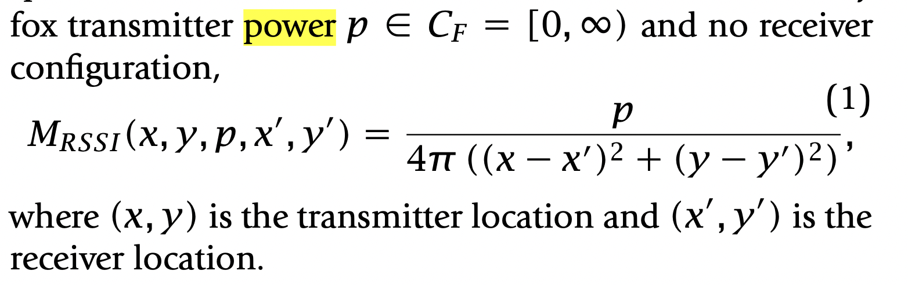
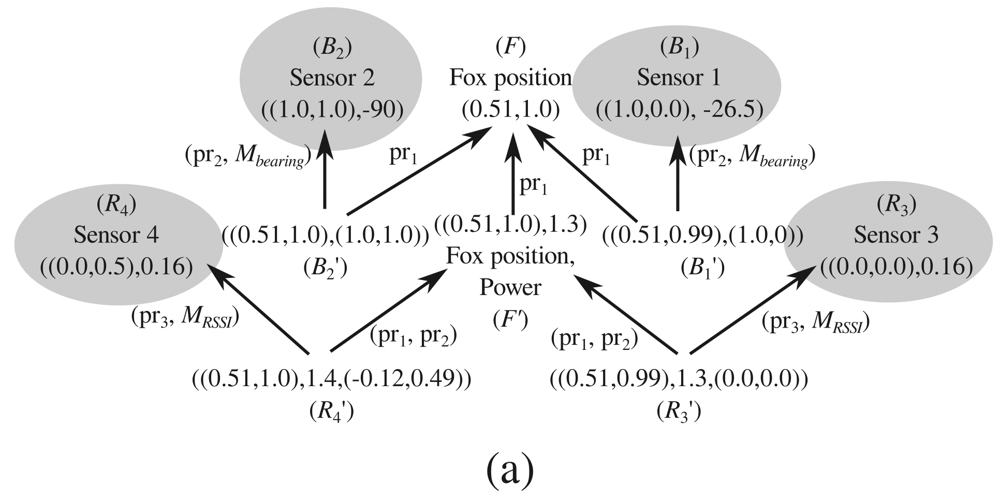

```{r setup, include=FALSE}
knitr::opts_chunk$set(echo = TRUE)
```

# Modeling the Sheaf in Hunting for Foxes with Sheaves:

For specifics and citations, reference https://www.ams.org/journals/notices/201905/rnoti-p661.pdf

@misc{https://doi.org/10.1090/noti1867,
  doi = {10.1090/noti1867},
  
  url = {https://www.ams.org/journals/notices/201905/rnoti-p661.pdf},
  
  author = {Robinson, Michael},
  
  keywords = {Data Analysis, Statistics and Probability (physics.data-an), FOS: Physical sciences, FOS: Physical sciences},
  
  title = {Hunting for Foxes with Sheaves},
  
  journal = {Notices of the American Mathematical Society},
  
  year = {2019}
}

# Relevant Libraries

```{r, message = FALSE, warning=FALSE}
library(tidyverse)
library(sp)
library(sf)
library(rgdal)
library(osmdata)
```

# Sheaf Model: Hunting Foxes with Sheaves

```{r, message=FALSE}
foxesdata <- read_csv("test.csv", 
    col_names = c("time", "x", "y", "name", "signal_strength", "bearing"))
################ seconds, m,   m,    NA,        watts,             deg.
```

Sensor $A$, Metric space $S1$ is the unit circle, 
The signal report is a pseudometric space $D_A$, depending on the sensor $A$. 

The sensor $A$ produces reports through a continuous measurement function
MA: $R2$ X $CF$ X $R2$ X $CA$ -> $D_A$,
depending on fox transmitter location (in the plane),
the fox transmitter equipment settings CF (such as transmitter power and antenna orientation),
the receiver location in the plane, and the receiver equipment settings CA (such as antenna orientation).

- Our sensor data will be drawn from a parameterized distribution SA, in which the noise level sigma is taken as a parameter.

- Received Signal Strength indication (RSSI) measures the amount of power absorbed by its antenna from the fox transmitter. 


## Sensors:

* Sensor 1 posiiton (x,y), denoted $\textbf{B1};$ 
* Receiver 1 posiiton (x',y'), denoted $\textbf{B1prime};$
* Sensor 2 posiiton (x,y), denoted $\textbf{B2};$
* Receiver 2 posiiton (x',y'), denoted $\textbf{B2prime};$
* Sensor 3 posiiton (x,y), denoted $\textbf{R3};$
* Receiver 3 posiiton (x',y'), denoted $\textbf{R3prime};$
* Sensor 4 posiiton (x,y), denoted $\textbf{R4};$
* Receiver 4 posiiton (x',y'), denoted $\textbf{R4prime};$

where (x,y) is the transmitter location and (x',y') is the receiver location.

# Functions

## ID Functions:
There are 10 ID functions.

B1: Sensor 1 position and bearing.  
B1': Fox position, Sensor 1 position.

```{r Functions ID B1 Transmitter}
# Sensor 1
ID_B1 <- function(stalk){
  stalk %>%
    select(c(s1x, s1y, bearing))
}

```

```{r Functions ID B1 Receiver}
# Sensor 1'
ID_B1prime <- function(stalk){
   stalk %>%
    select(c(foxx, foxy, s1x, s1y))
}
```

B2: Sensor 2 position and bearing.  
B2': Fox position, Sensor 2 position.

```{r Functions ID B2 Transmitter}
# Sensor 2
ID_B2 <- function(stalk){
  stalk %>%
    select(c(s2x, s2y, bearing))
}
```

```{r Functions ID B2 Receiver}
# Sensor 2'
ID_B2prime <- function(stalk){
  stalk %>%
    select(c(foxx, foxy, s2x, s2y))
}
```

R3: Sensor 3 position and RSSI.  
R3': Fox position and power, Sensor 3 position. 

```{r Functions ID R3 Transmitter}
# Sensor 3
ID_R3 <- function(stalk){
  stalk %>%
    select(c(s3x, s3y, rssi))
}
```

```{r Functions ID R3 Receiver}
# Sensor 3'
ID_R3prime <- function(stalk){
  stalk %>%
    select(c(foxx, foxy, power, s3px, s3py))
}
```

R4: Sensor 4 position and RSSI.  
R4': Fox position and power, Sensor 4 position.

```{r Functions ID R4 Transmitter}
# Sensor 4
ID_R4 <- function(stalk){
  stalk %>%
    select(c(s4x, s4y, rssi))
}
```

```{r Functions ID R4 Receiver}
# Sensor 4'
ID_R4prime <- function(stalk){
  stalk %>%
    select(c(foxx, foxy, power, s4px, s4py))
}
```

F: Fox position.  
F': Fox position, transmit power.
 
```{r Functions ID F Transmitter}
# Fox Position
ID_F <- function(stalk){
  stalk %>%
    select(c(foxx, foxy))
}
```

```{r Functions ID F Receiver}
# Fox Position
ID_Fprime <- function(stalk){
  stalk %>%
    select(c(foxx, foxy, power))
}
```


## Maps:
9 in total; 9 arrows in the diagram

Other, M:Bearing and Power
The bearing functions transform the (X,Y) location to compass bearing in degree. Output is a single number.
The power functions output fox transmitter power from transmitter location (X,Y) and receiver location (X',Y').



```{r}
B1prime_B1 <- function(stalk){
  stalk %>%
    mutate(bearing = atan2((s1x-s1px),(s1y-s1py))) %>% 
    select(bearing, s1x, s1y)
}
```

```{r}
B1prime_F <- function(stalk){
  stalk %>%
    select(c(foxx, foxy))
}
```

```{r}
B2prime_F <- function(stalk){
  stalk %>%
    select(c(foxx, foxy))
}
```

```{r}
Fprime_F <- function(stalk){
  stalk %>%
    select(c(foxx, foxy))
}
```

```{r}
B2prime_B2 <- function(stalk){
  stalk %>%
    mutate(bearing = atan2((s2x-s2px),(s2y-s2py))) %>% 
    select(bearing, s2x, s2y)
}
```

```{r}
R3prime_R3 <- function(stalk){
  stalk %>%
    mutate(rssi = power/(4*pi*(((s3x-s3px)^2 + (s3y-s3py)^2)))) %>%
    select(rssi, s3x, s3y)
}
```

```{r}
R4prime_R4 <- function(stalk){
  stalk %>%
    mutate(rssi = power/(4*pi*(((s4x-s4px)^2 + (s4y-s4py)^2)))) %>%
    select(rssi, s4x, s4y)
}
```

```{r}
R3prime_Fprime <- function(stalk){
  stalk %>%
    mutate(rssi = power/(4*pi*(((s4x-s4px)^2 + (s4y-s4py)^2)))) %>%
    select(rssi, foxx, foxy)
}
```

```{r}
R4prime_Fprime <- function(stalk){
  stalk %>%
    mutate(rssi = power/(4*pi*(((s4x-s4px)^2 + (s4y-s4py)^2)))) %>%
    select(rssi, foxx, foxy)
}
```

# Possible Assignemnts:

Case 5 and Case 1:


Two foxes, four sensors, 4 receivers.



```{r}
assignment <- read.csv("foxes_assignments.csv") 
head(assignment)
```

# Model:

```{r}
# functions are labeled source_destination
model <- tibble(map = c(ID_B1, ID_B1prime, ID_B2, ID_B2prime, ID_F,ID_Fprime,
                        ID_R3, ID_R3prime, ID_R4, ID_R4prime,Fprime_F, B1prime_B1,
                        B1prime_F, B2prime_B2,B2prime_F, R3prime_R3, R4prime_R4,
                        R3prime_Fprime, R4prime_Fprime),
                source = c("B1", "B1prime", "B2", "B2prime", "F", "Fprime",
                           "R3", "R3prime", "R4", "R4prime","Fprime", "B1prime",
                           "B1prime", "B2prime", "B2prime","R3prime", "R4prime",
                           "R3prime", "R4prime"),
                dest   = c("B1", "B1prime", "B2", "B2prime", "F", "Fprime","R3",
                           "R3prime", "R4", "R4prime","F","B1","F","B2","F",
                           "R3","R4","Fprime","Fprime"))

# Checked all sources and dests match functions
# size = 19x3, 9 ID + 10 maps

as.data.frame(model) -> model 
```


* Note: No need for unit conversions.


# Sheaf: case 1
key = sensor

```{r, tidy=TRUE, tidy.opts=list(width.cutoff=60)}
assignment %>%
  select(sensor, case1, entity)%>%
  pivot_wider(names_from = entity, values_from = case1)%>%
  mutate(across(c(s1x, s1y, s1px, s1py, s2x, s2y, s2px, s2py, s3x, s3y, s3px, s3py, s4x, s4y, s4px, s4py, bearing, rssi,power, foxx, foxy), as.numeric)) %>%
  right_join(model, by = c(sensor = "source"))%>%
  nest(stalkinput = 2:22) %>%
  mutate(stalkoutput = map2(.x= map, .y = stalkinput, .f = exec)) -> sheafc1
```


Consistency Var and SD for Sheaf case 1:

```{r}

sheafc1 %>%
  group_by(dest) %>%
  unnest(stalkoutput)%>%
  summarise(across(4:20, ~ var(.,na.rm = TRUE))) %>% 
  pivot_longer(cols = 2:17, names_to = "variable", values_to = "stalk")%>%
  filter(!is.na(stalk)) %>%
  ungroup() %>%
  summarise(ConsistVar = sd(stalk)) %>%
  sqrt()

sheafc1 %>%
  group_by(dest) %>%
  unnest(stalkoutput) %>%
  arrange(dest) %>%
  summarise(across(4:20, ~ n()*var(.,na.rm = TRUE))) %>% 
  pivot_longer(cols = 2:17, names_to = "variable", values_to = "stalk") %>%
  filter(!is.na(stalk)) %>%
  ungroup()%>%
  summarise(ConsistSD = sqrt(sum(stalk)))
```

# Sheaf: case 5
key = sensor

```{r}
assignment %>%
  select(sensor, case5, entity)%>%
  pivot_wider(names_from = entity, values_from = case5)%>%
  right_join(model, by = c(sensor = "source"))%>%
  nest(stalkinput = 2:22)%>%
  mutate(stalkoutput = map2(.x= map, .y = stalkinput, .f = exec)) -> sheafc5
```

Consistency Var and SD for Sheaf case 5:

```{r}
sheafc5 %>%
  group_by(dest) %>%
  unnest(stalkoutput)%>%
  summarise(across(4:20, ~ var(.,na.rm = TRUE))) %>% 
  pivot_longer(cols = 2:17, names_to = "variable", values_to = "stalk")%>%
  filter(!is.na(stalk)) %>%
  ungroup() %>%
  summarise(ConsistVar = sd(stalk)) %>% 
  sqrt()


sheafc5 %>%
  group_by(dest) %>%
  unnest(stalkoutput) %>%
  arrange(dest) %>%
  summarise(across(4:20, ~ n()*var(.,na.rm = TRUE))) %>% 
  pivot_longer(cols = 2:17, names_to = "variable", values_to = "stalk") %>%
  filter(!is.na(stalk)) %>%
  ungroup()%>%
  summarise(ConsistSD = sqrt(sum(stalk)))
```


From paper:
for c in hunting_sheaf.GetCellIndexList(): hunting_sheaf.MaximallyExtendCell(c)  :: Transitive Closure
hunting_sheaf.ComputeConsistencyRadius()
Out[17]:
0.0018896046913778324
Its consistency radius is small, but not zero, due to roundoff error

