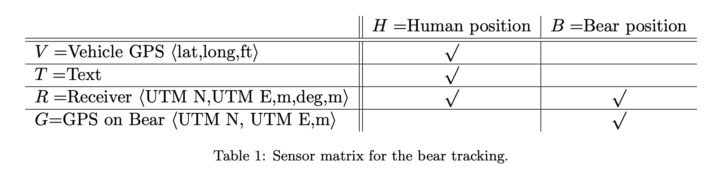
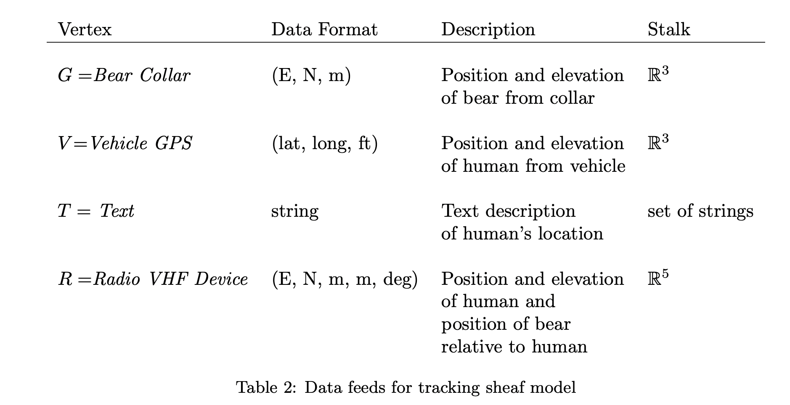
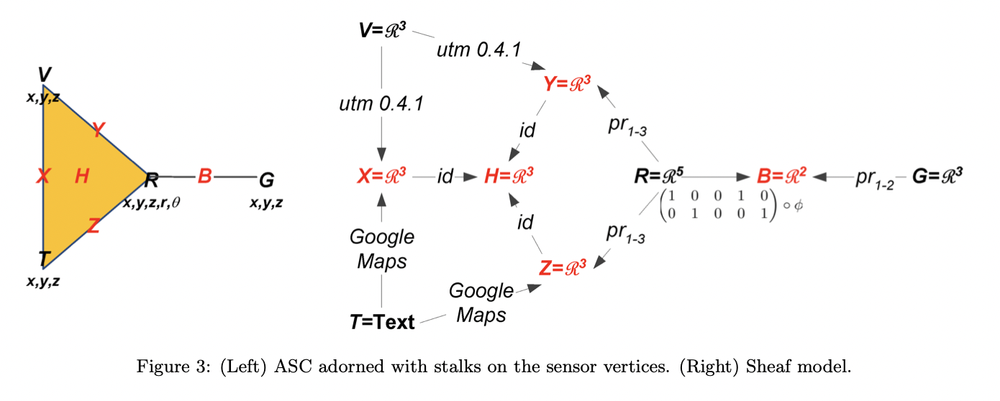
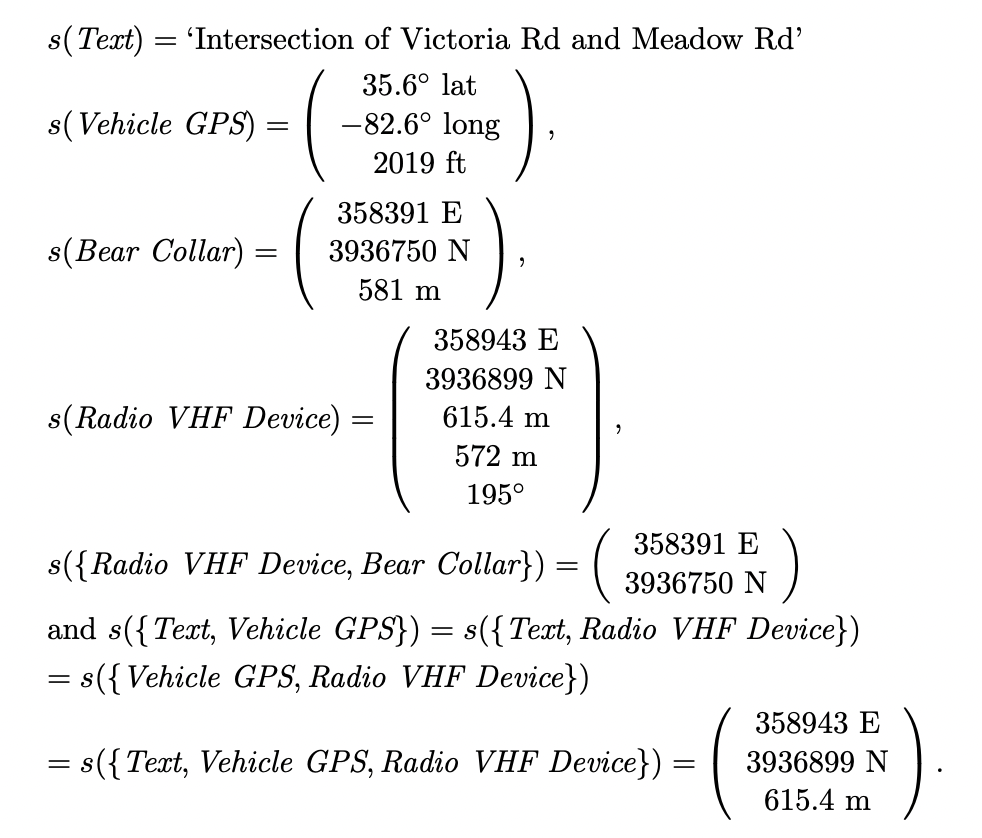
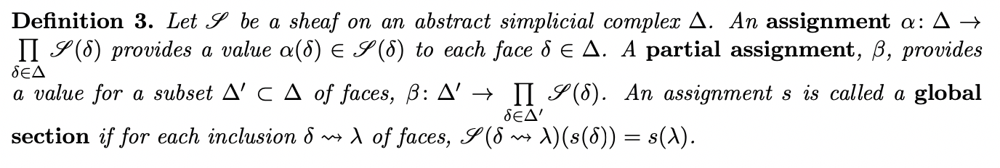

```{r setup, include=FALSE}
knitr::opts_chunk$set(echo = TRUE)
```


# Modeling the Geolocation Sheaf:

For specifics and citations, reference https://arxiv.org/abs/1912.05487

@misc{https://doi.org/10.48550/arxiv.1912.05487,
  doi = {10.48550/ARXIV.1912.05487},
  
  url = {https://arxiv.org/abs/1912.05487},
  
  author = {Joslyn, Cliff and Charles, Lauren and DePerno, Chris and Gould, Nicholas and Nowak, Kathleen and Praggastis, Brenda and Purvine, Emilie and Robinson, Michael and Strules, Jennifer and Whitney, Paul},
  
  keywords = {Data Analysis, Statistics and Probability (physics.data-an), FOS: Physical sciences, FOS: Physical sciences},
  
  title = {A Sheaf Theoretical Approach to Uncertainty Quantification of Heterogeneous Geolocation Information},
  
  publisher = {arXiv},
  
  year = {2019},
  
  copyright = {arXiv.org perpetual, non-exclusive license}
}


```{r}
library(tidyverse)
library(sp)
library(sf)
library(rgdal)
library(osmdata)
```

Sensors:
[• The GPS reading on the Bear Collar, denoted \textbf{G};  

[[• The Radio VHF Device receiver, denoted \textbf{R};] Location Bear 

• The Text report, denoted \textbf{T}; and  

• The Vehicle GPS, denoted \textbf{V}.]] Location Researcher  

\textbf{U = \{V, R, T, G\}} base sensor set ASC $\Delta$, representing the tracking sensor network, contains the face denoted $H = \{V, R, T \}$ and all nine faces are  
$ \Delta$ = { {V, R, T},  
{V, T}, {R, T}, {V, R},  
{R, G}, {V}, {R}, {T}, {G} }



With Pairwise interactions X, Y, and Z = {V, T,}, {V, R}, and {R, T} respectively.  



To convert the text descriptions we use Google Maps API [63] and to convert the (lat, long, ft) readings, coming from the vehicle, we use the Python open source package utm 0.4.1 [64].

$$\phi: \mathbb{R}^5 \to \mathbb{R}^5, \phi((x, y, z, r, \theta)^T) = (x, y, z, r cos(\theta), rsin(\theta))^T  $$




Step 1:  
## Restriction Functions:

Since the pairwise relations all share UTM coordinates, only id mappings are needed amongst them up to the three-way H face.  

IDs \textbf{ID function return itself, refer to image for components.}

```{r Functions Identity V}
ID_V <- function(stalk){
  stalk %>%
    select(c(x, y, z))
}
```

```{r Functions Identity T}
ID_T <- function(stalk){
  stalk %>%
    select(c(Text))
}
```

```{r Functions Identity R}
ID_R <- function(stalk){
  stalk %>%
    select(c(x, y, z, r, theta))
}
```

```{r Functions Identity G}
ID_G <- function(stalk){
  stalk %>%
    select(c(x, y, z))
}
```

```{r Functions Identity X}
ID_X <- function(stalk){
  stalk %>%
    select(c(x, y, z))
}
```

```{r Functions Identity Y}
ID_Y <- function(stalk){
  stalk %>%
    select(c(x, y, z))
}
```

```{r Functions Identity Z}
ID_Z <- function(stalk){
  stalk %>%
    select(c(x, y, z))
}
```

```{r Functions Identity B}
ID_B <- function(stalk){
  stalk %>%
    select(c(x, y))
}
```

```{r Functions Identity H}
ID_H <- function(stalk){
  stalk %>%
    select(c(x, y, z)) 
}
```

**** What are these again: ? ****

```{r Functions ID YH}
ID_YH <- function(stalk){
  #ID Function for the face? 
}
```

```{r Functions ID ZH}
ID_ZH <- function(stalk){
  #ID Function for the face? 
}
```

```{r Functions ID XH}
ID_XH <- function(stalk){
  #ID Function for the face? 
}
```


UTM 0.4.1 functions

For reference on the string specification being out of date:
https://inbo.github.io/tutorials/tutorials/spatial_crs_coding/


```{r}
#Testing
SP <- SpatialPoints(cbind(-82.6,35.6, 2019),
                    proj4string=CRS("+proj=longlat"))

spTransform(SP, CRS("+proj=utm +zone=17 +datum=WGS84")) # How to know how to specify zone...

Table %>% filter(key == "Z")
Table %>% filter(key == "V") %>% select(case1) -> coords
SpatialPoints(cbind(unlist(coords)), proj4string = CRS("+proj=longlat")) # pretty sure string specification is not recommended anymore but idk how to do the alternative. And this is quicker...

SitesNA <- c()
SitesNA$Latitude <- as.numeric(coords$case1[1])
SitesNA$Longitude <- as.numeric(coords$case1[2])
coordinates(SitesNA) -> coordstest
SpatialPoints(coordstest, proj4string = CRS("+proj=longlat")) -> im # makes s4
spTransform(im, CRS("+proj=utm +zone=17 +datum=WGS84"))

ToUTM <- function(stalk){
  coordsNA <- c()
  Table %>% filter(key == "Z") %>% select(case1) -> coords
  coordsNA$Latitude <- as.numeric(coords$case1[1])
  coordsNA$Longitude <- as.numeric(coords$case1[2])
  coordinates(coordsNA) -> coordssite
  SpatialPoints(coordssite, proj4string = CRS("+proj=longlat")) -> llcoords # makes s4
  spTransform(llcoords, CRS("+proj=utm +zone=17 +datum=WGS84")) -> tcoords
  print(tcoords)

}
ToUTM(Table)
```

```{r}
UTM_VX <- function(stalk){
  stalk %>%
    select(c()) #utm for v coords lat long utm
} # last step in test coords.

```

```{r}
UTM_VY <- function(stalk){
  stalk %>%
    select(c())# idenity
}
```

Google Maps


Feed google maps a text, get lat long, turn to UTM. 


```{r}
# Testing
library(osmdata)
opq(bbox = 'Asheville North Carolina') %>%
  add_osm_feature(key = 'road')%>%
  osmdata_sf()

opq(bbox = 'Asheville North Carolina') %>%
  osmdata_sf()


tibble(feature = available_features()) %>%
  filter(grepl("road", feature))

SP <- SpatialPoints(cbind(-82.6,35.6, 2019),
                    proj4string=CRS("+proj=longlat"))

spTransform(SP, CRS("+proj=utm +zone=17 +datum=WGS84"))
```
      
            	x	35.6	lat
Vehicle GPS	V	y	-82.6	long
Vehicle GPS	V	z	2019  ft # ft to meters 1 ft= 0.3048 m


```{r}
textcoords <- function(stalk){
  
  stalk %>%
    select(Text) -> string
  
  string %>%
  str_extract_all('([\\w]*?\\S+).(Rd|Road|St|Hwy|Highway|Dr|Ln|Lane|Ct|Court|Ave|Pl)') %>%
  unlist()%>%
  str_extract_all('\\b(?!(Rd|Road|St|Hwy|Highway|Dr|Ln|Lane|Ct|Court|Ave|Pl)\\b)\\w+') -> names
  
  readline(prompt = "Enter City in Quotes: ") -> inputcity
  print(inputcity) # checkpt
  city <- getbb(inputcity)
  head(city) #checkpt
  
  citystreets <- city %>%
    opq() %>%
    add_osm_feature("highway", c("motorway", "primary", "secondary", "tertiary", "residential","living_street","unclassified", "service", "footway")) %>%
    osmdata_sf()
  
  print(citystreets) #checkpt, non-zero?

  tibble(name = citystreets$osm_lines$name, geometry = citystreets$osm_lines$geometry) %>%
    filter(grepl(names[[1]], name)) %>%
    mutate(points = map(geometry, ~st_coordinates(.) %>% as.data.frame())) %>%
    unnest(points)-> geompoints_rd1 # coords to match
  print(geompoints_rd1)
  
  tibble(name = citystreets$osm_lines$name, geometry = citystreets$osm_lines$geometry) %>%
    filter(grepl(names[[2]], name)) %>%
    mutate(points = map(geometry, ~st_coordinates(.) %>% as.data.frame())) %>%
    unnest(points)-> geompoints_rd2 # coords to match 
  print(geompoints_rd2)
  
  inner_join(geompoints_rd1, geompoints_rd2, by = c(X = "X", Y = "Y")) %>% 
    select(X, Y) %>% head(1) %>%
    transmute(lat= Y, long = X)
  
}


# base test:
stalk <- data.frame(Text = c("Intersection at Victoria Rd and Meadow Rd"))
stalk2 <- data.frame(Text = c("Intersection of Wood Ave and Parker Road"))
# test with number streets

textcoords(stalk2)
```
```{r}
googlemaps_TX <- function(stalk){
  
}
```


```{r}
googlemaps_TZ <- function(stalk){
  
}
```


$pr_x-y$: Labels of the form prx-y are projections of the corresponding coordinates (also presentable as binary matrices of the appropriate form).

$pr_{1-2}$ 

```{r}
PRgb_1_2 <- function(stalk){
  stalk %>%
    select(c(x, y)) 
}
```

$pr_{1-3}$
```{r}
PRry_1_3 <- function(stalk){
  stalk %>%
    select(c(x, y, z))
}
```

```{r}
PRrz_1_3 <- function(stalk){
  stalk %>%
    select(c(x, y, z)) 
}
```

"Finally, the restriction from R up to B is the composition of the polar conversion of the final two components with the projection on the first two to predict the bear
position from the radiocollar GPS, bearing, and range."  

$$\begin{pmatrix}
1 & 0 & 0 & 1 & 0\\
0 & 1 & 0 & 0 & 1
\end{pmatrix} \circ
\phi:(x, y, z, r cos(\theta), rsin(\theta))^T  $$  


```{r Functions phi_RB}
phi_RB <- function(stalk){
  stalk %>%
    mutate(x = x+r*cos(theta), y = y+r*sin(theta)) %>%
    select(c(x, y))

}
```


Step 2:
## Assignment Table?:  


```{r}
Table <- read.csv("GeoAssignmentTable.csv") 
Table
```

MODEL:

```{r}
model <- tibble(map = c(ID_V, ID_T, ID_R, ID_G, ID_X, ID_Y, ID_Z, ID_B, ID_H, UTM_VX, UTM_VY,phi_RB,PRgb_1_2, PRry_1_3, PRrz_1_3, ID_YH, ID_ZH, ID_XH, googlemaps_TZ, googlemaps_TX),
                    source = c("V", "T", "R", "G", "X", "Y", "Z", "B", "H", "V", "V", "R", "G", "R", "R", "Y", "Z", "X", "T", "T"), #key == source
                    dest =   c("V", "T", "R", "G", "X", "Y", "Z", "B", "H", "X", "Y", "B", "B", "Y", "Z", "H", "H", "H", "Z", "X")
                   )
as.data.frame(model) -> model #20x11
# Checked all sources and dests match functions √
```

Atatch model to table, and excecute functions to make full sheaf model w outputs:


```{r}
Table %>%
  select(entity, case1, key)%>%
  pivot_wider(names_from = entity, values_from = case1) %>%
  right_join(model, by = c(key = "source")) %>%
  nest(stalkinput = 2:9) -> checks #%>%
  #mutate(stalkoutput = map2(.x= map, .y = stalkinput, .f = exec)) -> sheaf 
```


##Global Sections
Definition 3:  




