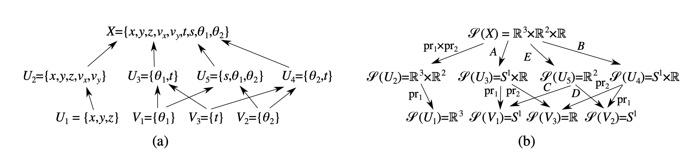

```{r setup, include=FALSE}
knitr::opts_chunk$set(echo = TRUE)
```


# Modeling Robinson's SheafCanon Sheaf:

For specifics and citations, reference https://arxiv.org/abs/1603.01446

Robinson, Michael. “Sheaves Are the Canonical Data Structure for Sensor Integration.” Information Fusion, vol. 36, Elsevier B.V, 2017, pp. 208–24, https://doi.org/10.1016/j.inffus.2016.12.002.


```{r}
library(tidyverse)
```


```{r Table 1}
assignment <- read.csv("canonAssignment.csv") # Copied Table 1, page 218.
assignment
```

```{r Global Vars?}
#Should these be global variables?
r_1x <- -73.662574
r_1y <- 42.733838
r_2x <- -77.0897
r_2y <- 38.935
```

What should be done with variables outside of the assignment table that we need? Constraints for functions not in any assignment table...

## Restriction Functions:
Page 214: s_x, s_y are coordinates of an object detected in the satellite image, r_1x, r_1y are coordinates of the first RDF sensor and r_2x, r_2y are coordinates of the second RDF sensor. 

$$A(x, y, z, v_x, v_y, t) = \bigg(tan^{-1}\frac{x+v_xt-r_{1x}}{y+v_yt-r_{1y}}, t\bigg)$$

## Restriction Maps 

```{r Functions A}
A <- function(stalk) {
  r_1x <- -73.662574
  r_1y <- 42.733838

  stalk %>%
    mutate(Theta1=180/pi*atan2(x + v_x*t/(110.567*cos(y*pi/180)) - r_1x, y + v_y*t/110.567 - r_1y)) %>% # degrees
    select(Theta1, t)
  
}
```


$$B(x, y, z, v_x, v_y, t) = \bigg(tan^{-1}\frac{x+v_xt-r_{2x}}{y+v_yt-r_{2y}}, t\bigg)$$

```{r Functions B}
B <- function(stalk) {
  r_2x <- -77.0897
  r_2y <- 38.935
  
    stalk %>%
      mutate(Theta2= 180/pi*atan2(x + v_x*t/(110.567*cos(y*pi/180)) - r_2x, y + v_y*t/110.567 - r_2y)) %>% # degrees
      select(Theta2, t)
}
```


$$C(s_x, s_y) = tan^{-1}\frac{s_x-r_{1x}}{s_y-r_{1y}}$$

```{r Functions C}
C <- function(stalk) {
  r_1x <- -73.662574
  r_1y <- 42.733838

  stalk %>%
    mutate(Theta1=atan2(s_x - r_1x, s_y - r_1y)) %>%
    select(c(Theta1))
}
```


$$D(s_x, s_y) = tan^{-1}\frac{s_x-r_{2x}}{s_y-r_{2y}}$$


```{r Functions D}
D <- function(stalk){
  r_2x <- -77.0897
  r_2y <- 38.935

  stalk %>%
    mutate(Theta2=atan2(s_x - r_2x, s_y - r_2y)) %>%
    select(c(Theta2))
}
```

$$E(x, y, z, v_x, v_y, t) = (x+v_xt, y+v_yt)$$

 s = expected location, where coordinates = y + displacement and x+ displacement from the equation 
 
```{r Functions E}
E <- function(stalk) {
    stalk %>%
      mutate(s_x = c(x + v_x*t/(110.567*cos(y*pi/180))), s_y = c(y + v_y*t/110.567)) %>% # degrees
      select(c(s_x, s_y))
}

```


```{r Functions Proj 1}
pr1xpr2 <- function(stalk){ 
  stalk %>%
      select(c(x, y, z, v_x, v_y))
}
```

pr1 for u2 -> u1

```{r Functions Proj 2}
U2_pr1 <- function(stalk){
  stalk %>%
  select(c(x, y, z))
}
```

pr1 for u3 -> v1

```{r Functions Proj 3}
U3_pr1 <- function(stalk){
  stalk %>%
      select(c(Theta1))
}
```

pr2 for u3 -> v3

```{r Functions Proj 4}
U3_pr2 <- function(stalk){
  stalk %>%
      select(c(t))
}
```

pr1 for u4 -> v2

```{r Functions Proj 5}
U4_pr1 <- function(stalk){
  stalk %>%
      select(c(Theta2))
}
```

pr1 for u4 -> v3

```{r Functions Proj 6}
U4_pr2 <- function(stalk){
  stalk %>%
      select(c(t))
}

```

\textbf{ID function return itself, refer to image for components.}

```{r Functions Identity X}
ID_X <- function(stalk){
  stalk %>%
    select(c(x, y, z, v_x, v_y, s_x, s_y, t, Theta1, Theta2))
}
```


```{r Functions Identity U1}
ID_U1 <- function(stalk){
  stalk %>%
    select(c(x, y, z))
}
```


```{r Functions Identity U2}
ID_U2 <- function(stalk){
  stalk %>%
    select(c(x, y, z, v_x, v_y))
}
```


```{r Functions Identity U3}
ID_U3 <- function(stalk){
  stalk %>%
    select(c(Theta1, t))
}
```


```{r Functions Identity U4}
ID_U4 <- function(stalk){
  stalk %>%
    select(c(Theta2, t))
}
```


```{r Functions Identity U5}
ID_U5 <- function(stalk){
  stalk %>%
    select(c(s_x, s_y, Theta1, Theta2))
}
```


```{r Functions Identity V1}
ID_V1 <- function(stalk){
  stalk %>%
      select(c(Theta1))
}
```


```{r Functions Identity V2}
ID_V2 <- function(stalk){
  stalk %>%
      select(c(Theta2))
}
```


```{r Functions V3}
ID_V3 <- function(stalk){
  stalk %>%
      select(c(t))
}
```


## Table representation of Figure 6 (b), page 214:



Pre-sheaf:

```{r Table 6B}
model <- tibble(source = c("X", "X", "X", "X", "U2", "U3", "U3", "U5", "U5", "U4", 
                           "U4", "X", "U1", "U2", "U3", "U4", "U5", "V1", "V2", "V3"), 
               dest =  c("U2", "U3", "U5", "U4", "U1", "V1", "V3", "V1", "V2", "V3",
                          "V2", "X", "U1", "U2", "U3", "U4", "U5", "V1", "V2","V3"),
               map = c(pr1xpr2, A, E, B, U2_pr1, U3_pr1, U3_pr2, C, D, U4_pr2,
                        U4_pr1, ID_X, ID_U1, ID_U2, ID_U3, ID_U4, ID_U5, ID_V2, 
                        ID_V2, ID_V3))
```

Note: exec takes the function in .x and runs with input .y

```{r}
assignment %>%
  select(variable, case2, source)%>%
  pivot_wider(names_from = "variable", values_from = "case2") %>%
  right_join(model, by = c(source = "source"))%>%
  nest(stalkinput = !source & !map & !dest)%>%
  mutate(stalkoutput = map2(.x= map, .y = stalkinput, .f = exec)) -> FinSheaf 

FinSheaf
```


## Consistency Radius: 

radius=ish sd/var of stalkoutputs/ diameter of stalkoutputs. Coord. comp
Unnest, aggregate along all of the columns. 
Put the STD together, remember units are diff
chi square, norm. var. 
Ideally have user supply aggregation function. 

process below should be a specific function, so to optimize consistency radius. best consistency radius function like lm() taking consistency radius function.

$$d_U(x,y) = \sqrt{\sum_{i \in columns} \frac{A_i}{ncol} | x_i - y_i| ^2}$$
A_i is the unit conversion.

Unit Conversions:; note- We converted everything to radians. 

```{r, Units}
UnitScale <- tibble(variable = c("x", "y", "z", "v_x", "v_y", "t", "Theta1", "Theta2", "s_x", "s_y"),
                    scale = c(1*110.567*cos(43*pi/180), 1*110.567, 1/1000, 1, 1, 1, pi/180, pi/180, 1*110.567*cos(43*pi/180), 1*110.567)) # Scaling units

SensorScale <- FinSheaf %>% count(dest) # Scaling Sensors, by n?
```


#Consistency Radius
```{r}
FinSheaf%>%
  group_by(dest) %>%
  unnest(stalkoutput) %>%
  pivot_longer(cols = !source & !dest & !map & !stalkinput, names_to = "variable", values_to = "stalk")%>%
  left_join(assignment, by = c(variable = "variable", source = "source"), multiple = "all")%>%
  mutate(deviations = (stalk-case1)^2)%>%
  filter(!is.na(deviations))%>%
  left_join(UnitScale, by = c(variable = "variable"), multiple = "all")%>%
  mutate(ScaleValue = deviations*scale^2) %>% # conversion factor applied
  ungroup() %>%
  summarise(ConsistRad = sqrt(sum(ScaleValue)))
# case1: 16.52
# case2: 0
# case3: 325.96
```

```{r}
FinSheaf %>%
  group_by(dest)%>%
  unnest(stalkoutput)%>%
  ungroup() %>%
  summarise(across(!source & !map & !dest & !stalkinput, ~ var(.,na.rm = TRUE)))%>% 
  pivot_longer(everything() ,names_to = "variable", values_to = "stalk")%>%
  filter(!is.na(stalk)) %>%
  left_join(UnitScale, by = c(variable = "variable")) %>%
  mutate(ScaleValue = n()*stalk*scale^2) %>% # conversion factor applied
  summarise(ConsistVar = sum(ScaleValue))# should be a single number.
```


```{r}
FinSheaf %>%
  group_by(dest) %>%
  unnest(stalkoutput)%>%
  pivot_longer(!source & !dest & !map & !stalkinput, names_to = "variable", values_to = "stalk")%>%
  left_join(assignment, by = c(variable = "variable", source = "source")) %>%
  mutate(deviations = (stalk-case1)^2) %>%
  filter(!is.na(deviations))%>%
  left_join(UnitScale, by = c(variable = "variable")) %>%
  mutate(ScaleValue = deviations*scale^2) %>% # conversion factor applied
  ungroup() %>%
  summarise(ConsistRad = sqrt(sum(ScaleValue)))

#= 36.3469

```


```{r}
#Consistency Variance
FinSheaf %>%
  group_by(dest)%>%
  unnest(stalkoutput)%>%
  ungroup() %>%
  summarise(across(!source & !map & !dest & !stalkinput, ~ var(.,na.rm = TRUE)))%>% # Probs dont want var...
  pivot_longer(everything() ,names_to = "variable", values_to = "stalk")%>%
  filter(!is.na(stalk)) %>%
  left_join(UnitScale, by = c(variable = "variable")) %>%
  mutate(ScaleValue = n()*stalk*scale^2) %>% # conversion factor applied
  summarise(ConsistVar = sum(ScaleValue))# should be a single number.


FinSheaf %>%
  group_by(dest) %>%
  unnest(stalkoutput)%>%
  ungroup()%>%
  summarise(across(!source & !dest & !map & !stalkinput, ~ n()*var(.,na.rm = TRUE)))%>%
  pivot_longer(everything(), names_to = "variable", values_to = "stalk") %>%
  filter(!is.na(stalk)) %>%
  left_join(UnitScale, by = c(variable = "variable")) %>%
  mutate(ScaleValue = stalk*scale^2) %>% # conversion factor applied
  summarise(ConsistSD = sum(ScaleValue)) %>%
  sqrt()
```

#variances add. SD's dont. 

# have pre-consistency radii , un-group and aggregate all rads to get consistency radius.
# ends with: for each stalk you have a radius, then aggregate them, max, sum of squares. 

```{r}
# #Need sheaf and assignment as easy to get things within the df.. I need an assignment table.
# consistrad <- function(sheaf, assignment){
#   sheaf %>% select(stalkoutput)
#     
# }
```


# Transitive Closure:

```{r}
transitive_closure <- function(sheaf, weight_vec){
  # or function(sheaf, weight_vec, source_col, dest_col)
  # ** input weight vec specs. 
  verticies <- as.character(unique({{sheaf}}$dest))
  iter <- 0
  
  graph <- tibble(source=factor({{sheaf}}$source,levels=verticies),
                 dest=factor({{sheaf}}$dest,levels=verticies))
  
  graph %>%
    mutate(temp=1)%>% 
    pivot_wider(names_from=dest,
                values_from=temp,
                values_fill=0L, #?
                id_expand = TRUE,  # The _expand options use the factor levels
                names_expand = TRUE) -> incidence_tib
  
  incidence_tib$source -> source
  
  incidence_tib %>%
    select(!source)%>%
    as.matrix()-> incidence_matrix
  diag(incidence_matrix) <- 0
  
  incidence_matrix -> incidence_matrix_updated
  while(norm(incidence_matrix_updated) > 1e-3){
    incidence_matrix %*% incidence_matrix_updated -> incidence_matrix_updated
    
    incidence_matrix_updated %>%
      as.data.frame()%>%
      mutate(source = source)%>%
      pivot_longer(cols = !source, names_to = "dest", values_to ="value") %>%
      filter(value != 0) %>%
      select(!value) -> new_edge
    
    iter <<- iter + 1
    
    graph %>%
      bind_rows(new_edge) -> graph
  }
  return(graph)
  print(iter)
}
```


```{r}
closure <- transitive_closure(FinSheaf)

FinSheaf %>% nest_by(source, dest) %>% map(., transitive_closure()

#X goes to U2, which goes to U1: pr1xpr2, pr1

closure %>% rowwise(pluck())


FinSheaf %>% 
  mutate(s2 = source, d2 = dest) %>%
  nest(s2, d2) %>% rename(pairs = data) %>%
  nest_by(source, dest, stalkinput, stalkoutput) %>%
  rename(map_pairs = data) %>%
  merge(closure, all = T)

```
X to U1, we want X-> U2, U2 -> U1


I want to store a pair of edges for each new composition and then nest them and then map them. 


# Questions:

From PNLL+Robinson paper

Joslyn, Cliff A., et al. “A Sheaf Theoretical Approach to Uncertainty Quantification of Heterogeneous Geolocation Information.” Sensors (Basel, Switzerland), vol. 20, no. 12, MDPI, 2020, p. 3418–, https://doi.org/10.3390/s20123418.

The consistency radius (more fully developed by Robinson [2] in later work) provides a native global measure of the uncertainty among the sensors present in any reading. Beyond that, the consistency filtration provides a detailed breakdown of the contributions of particular sensors and sensor combinations to that overall uncertainty.

Pseudometric: function that takes in 2 elements of a set, produces a non-negative real number.
d_u is a pseudometric. 

Maximum aggregation variant:
Note: \mathcal{} marking sheaves and collections of subsets. :)
Supremum vs Max:
- Least of upper bounds
vs
- The biggest one
-1/x x>0, always a negative number. Any positive is an upper bound. Least of upper bounds is zero. SUP = 0, Max = ND.
In practice, MAX.

$$c_{\mathcal{S}}(a) := \sup_{U \subseteq V \in \mathcal{T}} \; d_U((\mathcal{S}(U \subseteq V)) a(V), a(U))$$
^ Sensitive to outliers. Better for theorem proving.
d_U is a function/pseudometric that produces real number. 

Norm: input element of set, produces non-negative real number.

Stalk outputs: $\mathcal{S}(U \subseteq V)) a(V)$

Lest squares aggregation variant:
$$c_{\mathcal{S}}(a) := \sqrt{\sum_{U \subseteq V \in \mathcal{T}} \; d_u((\mathcal{S}(U \subseteq V)) a(V), a(U))^2}$$
Least squares aggregation variant of consistency:: I.e consistency radius per “A Sheaf Theoretical Approach to Uncertainty...”

sqrt(
  sum(
    (stalkoutput-assignment_case)^2
  )
)

This method is less sensitive to outliers than taking the supremum of the distances between stalkoutput and assignments.

Every norm on $\mathbb{R}^n$ has an associated consistency radius. 

Small means min. disagreement among observations, large some sensors disagree.

Per Pysheaf: Computes the error between the data assignments and extended assignments on the sheaf
      :param numpyNormType: Optional, how the errors across the sheaf are combined.
      default is take maximum error.
      :param cellStartIndices: Optional, which cells may start the data flowed into 
      this cell
      :returns: Error between the data assignments and extended assignments on the 
      sheaf

norm(differences in assignment?)

Testing variances:

have pre-consistency radii , un-group and aggregate all rads to get consistency radius.
ends with: for each stalk you have a radius, then aggregate them, max, sum of squares. 

